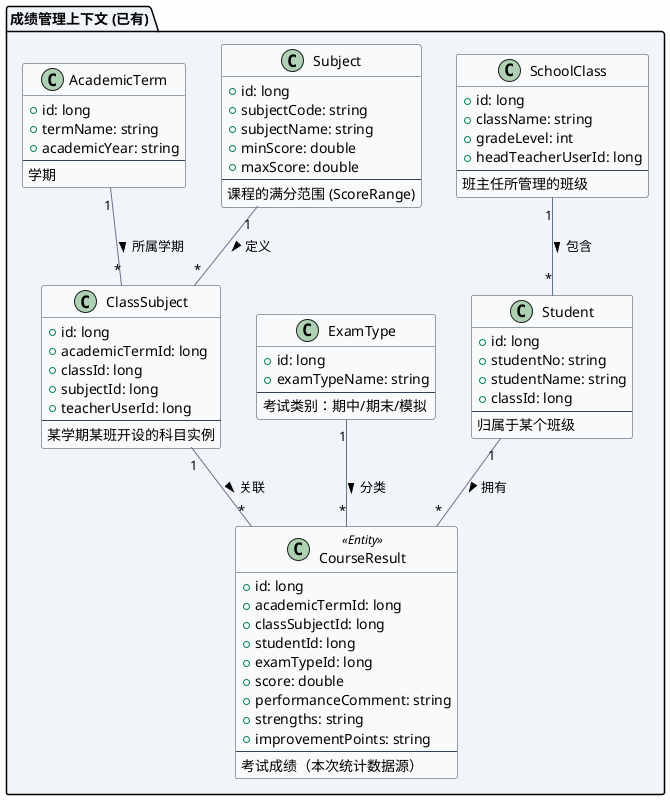
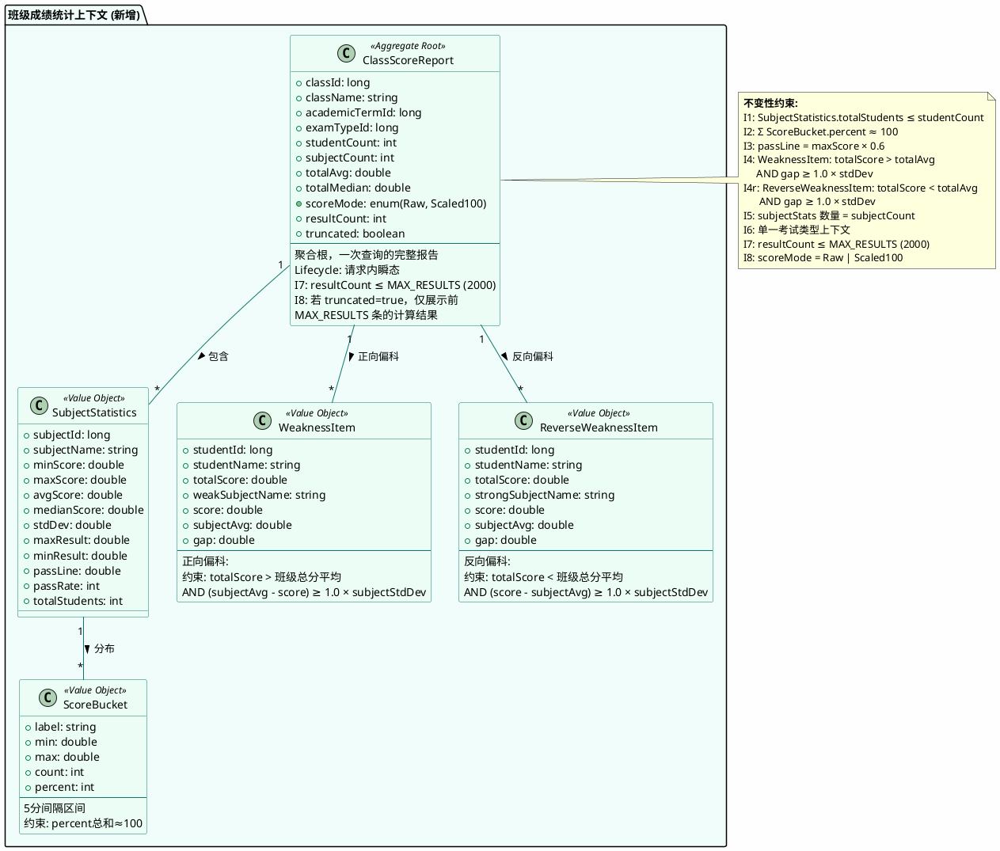
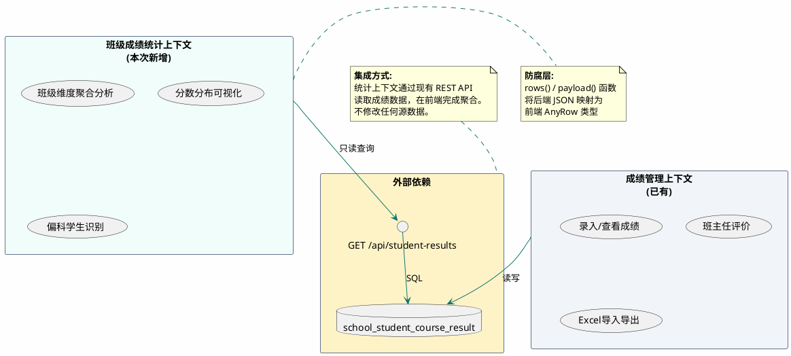
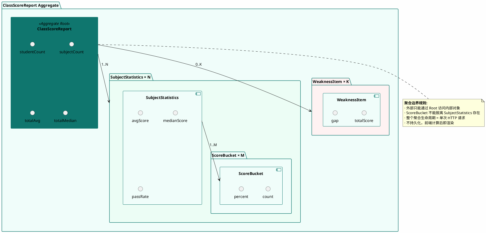
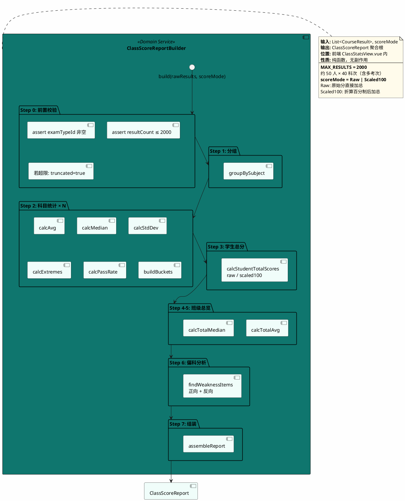
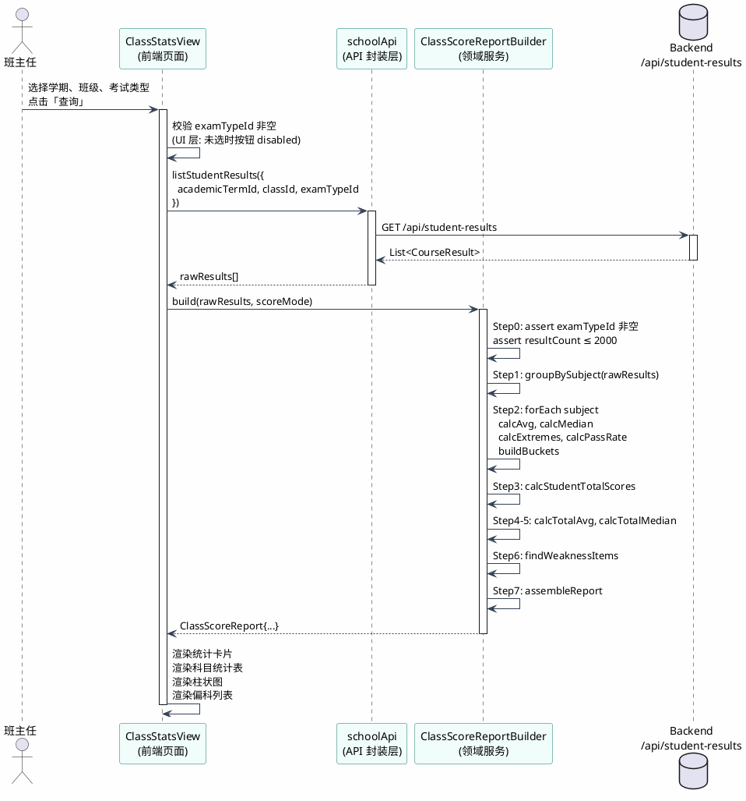
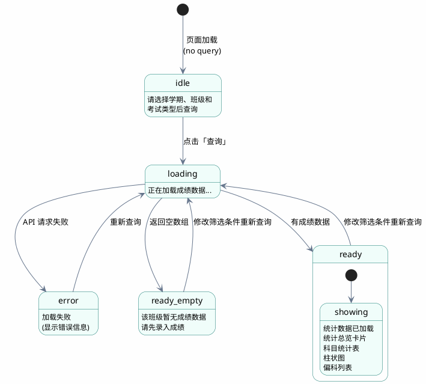
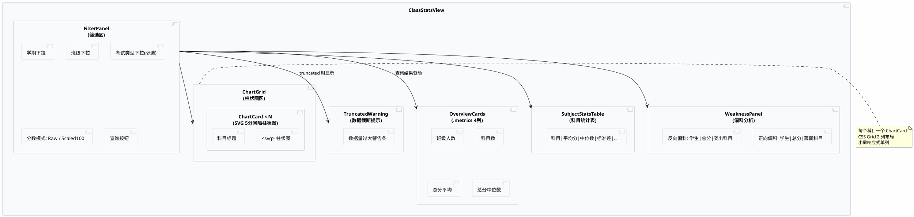
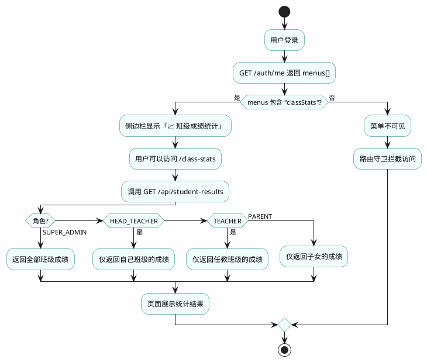
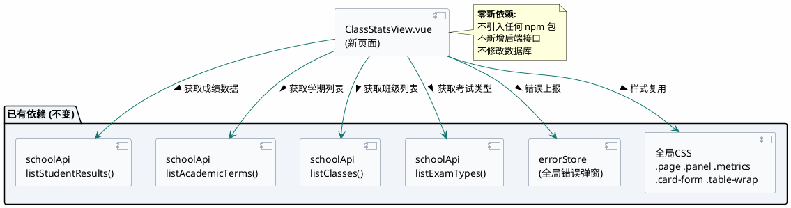

# 班级成绩统计 — 领域建模设计文档

> 版本：v2.2 | 日期：2026-08-04 | 作者：Anran Fan

---

## 目录

1. [业务动机](#1-业务动机)
2. [通用语言](#2-通用语言ubiquitous-language)
3. [领域模型](#3-领域模型)
4. [聚合设计](#4-聚合设计)
5. [领域服务](#5-领域服务)
6. [应用流程](#6-应用流程)
7. [接口与展现](#7-接口与展现)
8. [文件变更与依赖](#8-文件变更与依赖)
9. [验证方案](#9-验证方案)
10. [前瞻展望](#10-前瞻展望非本期范围)

---

## 1. 业务动机

当前系统以**学生个体**为粒度管理成绩（`ScoresView.vue`），班主任可以逐一查看/录入每位学生的各科成绩和综合评价。但当需要从**班级维度**回答以下问题时，缺乏支撑：

> - 这个班语文平均分多少？数学呢？哪些科目整体偏弱？
> - 分数分布是正态还是两极分化？
> - 哪些学生总分不错但存在明显偏科，值得重点关注？

本需求引入一个新的**分析型限界上下文**——班级成绩统计，从班级维度聚合成绩数据并提供统计洞察。

---

## 2. 通用语言（Ubiquitous Language）

| 术语（中 / EN） | 定义 | 所属上下文 |
|---|---|---|
| **班级** Class | 一组学生与一位班主任的集合，有年级和届次属性 | 班级管理 |
| **学生** Student | 归属于某个班级的学习者，有学号和姓名 | 学生管理 |
| **科目** Subject | 一门可教授并可考试评分的课程，有满分范围 | 课程管理 |
| **班课** ClassSubject | 某学期某班级开设的具体科目实例，关联任课老师 | 课程管理 |
| **考试成绩** CourseResult | 某个学生在某次考试中某科目的得分与评语 | 成绩管理 |
| **考试类型** ExamType | 考试的类别（期中、期末、模拟考等） | 配置管理 |
| **学期** AcademicTerm | 学年中的一段教学周期 | 配置管理 |
| **科目统计** SubjectStatistics | 某班级在某考试中各科目的聚合统计指标 | **本次新增** |
| **分数段** ScoreBucket | 按 5 分间隔切分的成绩区间，含人数与占比 | **本次新增** |
| **班级总分** StudentTotalScore | 一个学生在某次考试中所有科目的得分加总 | **本次新增** |
| **班级成绩报告** ClassScoreReport | 一次查询的聚合根，包含统计总览、各科统计、分布图、偏科分析 | **本次新增** |
| **偏科记录** WeaknessItem | 总分高于班级平均分但单科低于该科平均分的学生+科目组合 | **本次新增** |
| **反向偏科记录** ReverseWeaknessItem | 总分低于班级平均分但单科远高于该科平均分的学生+科目组合（严重偏科导致总分被拉低） | **本次新增** |
| **偏科差距阈值** WeaknessGapThreshold | 单科分数低于/高于科目平均分的差距倍数阈值，默认为 `1.0 × stdDev`，避免微小波动被误报为偏科 | **本次新增** |
| **标准分** ScaledScore | 将不同满分值的原始分按比例折算到统一满分（如百分制），使跨科目总分可比。`scaled = raw / maxScore × 100` | **本次新增** |
| **原始总分** RawTotalScore | 各科原始分直接加总的总分（不折算），保留科目权重差异 | **本次新增** |
| **及格线** PassLine | = `maxScore × 0.6` | **本次新增** |

---

## 3. 领域模型

### 3.1 现有领域对象（只读复用）



### 3.2 新增领域对象（值对象 + 聚合根）



### 3.3 上下文映射



---

## 4. 聚合设计



---

## 5. 领域服务

### 5.1 ClassScoreReportBuilder（报告构建器）



### 5.2 核心算法规格

#### buildBuckets — 分数段构建

```
FUNCTION buildBuckets(scores[], minScore, maxScore, binSize = 5)
  binStart  = floor(minScore / binSize) * binSize
  binEnd    = ceil(maxScore / binSize) * binSize
  bins      = []

  FOR low = binStart; low < binEnd; low += binSize:
    high    = low + binSize
    isLast  = (high >= binEnd)
    count   = isLast
      ? COUNT(scores WHERE score ≥ low AND score ≤ high)
      : COUNT(scores WHERE score ≥ low AND score < high)

    bins.ADD(ScoreBucket{
      label:   "{low}-{high}",
      min:     low,   max:    high,
      count:   count,
      percent: ROUND(count / scores.length * 100)
    })
  RETURN bins
```

#### calcStudentTotalScores — 学生总分

```
FUNCTION calcStudentTotalScores(rawResults[], scoreMode)
  studentTotals = GROUP rawResults BY studentId MAP {
    id:     studentId,
    name:   studentName,
    scores: COLLECT { subjectId, subjectName, score, maxScore },
  }

  IF scoreMode == Scaled100:
    // 折算百分制：各科除以满分再乘 100
    FOR EACH student IN studentTotals:
      scaledSum = 0
      FOR EACH score IN student.scores:
        scaledSum += score.score / score.maxScore * 100
      student.totalScore = scaledSum
  ELSE:
    // Raw：原始分直接加总（保留科目权重差异）
    FOR EACH student IN studentTotals:
      student.totalScore = SUM(student.scores.score)

  RETURN studentTotals
```

**注意**：`Raw` 模式下，满分高的科目（如语文 150）在总分中权重更大，年级横向对比时可选择 `Scaled100` 消除权重差异。

---

#### findWeaknessItems — 偏科识别（正向 + 反向）

```
CONST THRESHOLD_MULTIPLIER = 1.0  // stdDev 倍数阈值

FUNCTION findWeaknessItems(rawResults[], subjectStats[], studentTotals[], totalAvg)
  forwardItems  = []   // 正向偏科：总分高但单科低
  reverseItems  = []   // 反向偏科：总分低但单科高

  FOR EACH student IN studentTotals:
    FOR EACH score IN student.scores:
      stat = FIND subjectStats WHERE subjectId = score.subjectId
      IF stat == null: SKIP

      gap = score.score - stat.avgScore    // 正=高于平均，负=低于平均
      threshold = THRESHOLD_MULTIPLIER * stat.stdDev

      // 正向偏科：总分高于平均，单科显著低于该科平均
      IF student.totalScore > totalAvg AND -gap ≥ threshold:
        forwardItems.ADD(WeaknessItem{
          studentId:    student.id,
          studentName:  student.name,
          totalScore:   student.totalScore,
          weakSubjectName: stat.subjectName,
          score:        score.score,
          subjectAvg:   stat.avgScore,
          gap:          -gap
        })

      // 反向偏科：总分低于平均，但单科显著高于该科平均
      IF student.totalScore < totalAvg AND gap ≥ threshold:
        reverseItems.ADD(ReverseWeaknessItem{
          studentId:          student.id,
          studentName:        student.name,
          totalScore:         student.totalScore,
          strongSubjectName:  stat.subjectName,
          score:              score.score,
          subjectAvg:         stat.avgScore,
          gap:                gap
        })

  SORT forwardItems BY gap DESC
  SORT reverseItems BY gap DESC
  RETURN { forwardItems, reverseItems }
```

**说明**：
- 使用 `stdDev` 作为阈值基准，避免微小波动（如差 0.5 分）被误报为偏科
- 正向偏科用于发现「看似总分不错，但某科拖后腿」的学生
- 反向偏科用于发现「总分被其他弱科拖累，但某科特别突出」的学生（这类学生总分低容易被忽略）
- `THRESHOLD_MULTIPLIER` 可在后续根据实际数据调优

---

## 6. 应用流程

### 6.1 查询流程序列图



### 6.2 页面状态机



---

## 7. 接口与展现

### 7.1 数据源 API

| API | 方法 | 说明 |
|-----|------|------|
| `/api/student-results` | GET | `academicTermId` + `classId` + `examTypeId`（均必填），返回 `List<Map>` |
| `/api/academic-terms` | GET | 学期列表 |
| `/api/classes` | GET | 班级列表（已做角色权限过滤） |
| `/api/exam-types` | GET | 考试类型列表 |

> ⚠️ **双重防护**：
> 1. **UI 层**：考试类型下拉为必选项，未选择时「查询」按钮 disabled
> 2. **Builder 层**：`build()` 入口 assert `examTypeId != null`，非法调用直接抛出 `"请选择考试类型"`
>
> **原因**：后端 API 所有参数 `required=false`，若前端校验遗漏会导致多考次数据混叠，所有统计（均值、分布、偏科）失真。
>
> ⚠️ **数据量限制**：`MAX_RESULTS = 2000`。当 API 返回超过 2000 条时，Builder 截断数据并设置 `truncated = true`，页面展示警告提示「数据量过大，仅展示前 2000 条结果」。

### 7.2 页面组件树



### 7.3 菜单配置

| 配置项 | 值 |
|--------|-----|
| 路由路径 | `/class-stats` |
| menuKey | `classStats` |
| 菜单顺序 | 在 `scores` 之后，`transcripts` 之前 |
| 中文标签 | `班级成绩统计` |
| 图标 | 📈 |

### 7.4 权限与可见性



---

## 8. 文件变更与依赖

### 8.1 变更清单

| 文件 | 操作 | 说明 |
|------|------|------|
| `xinshi-admin-frontend/src/views/ClassStatsView.vue` | **新建** | ~500 行，包含领域服务逻辑 + SVG 图表 |
| `xinshi-admin-frontend/src/router/index.ts` | 修改 | +5 行，新增 `/class-stats` 路由 |
| `xinshi-admin-frontend/src/App.vue` | 修改 | +3 行，新增 menuOrder/staticLabels/menuIcons |
| 后端 menus 数据 | **需同步** | 将对应用户角色的 `menus` 加入 `classStats` |

### 8.2 依赖关系



---

## 9. 验证方案

| 编号 | 验证项 | 方法 | 预期 |
|------|--------|------|------|
| V1 | 路由可达 | 访问 `/class-stats` | 页面正常渲染 |
| V2 | 聚合计算 Raw | 准备 3 科已知成绩，scoreMode=Raw | 均值/中位数/分布与人工 Excel 一致 |
| V3 | 聚合计算 Scaled100 | 同数据，scoreMode=Scaled100 | 语 150/数 150/英 120 满分折算后总分权重一致 |
| V4 | 分数段完整性 | 检查 buckets 的 percent 总和 | ≈ 100（±1） |
| V5 | 分数段边界 | 测试 score==60.0（bin 边界）、score==100.0（满分） | 正确落入对应 bin |
| V6 | 正向偏科 | 人工构建总分>均分且单科低于均分的学生 | 正确检出 |
| V7 | 反向偏科 | 人工构建总分<均分但单科远高于均分的学生 | 正确检出 |
| V8 | 偏科阈值 | 构造差 0.5 分的微小波动数据 | 不被误报（stdDev 过滤生效） |
| V9 | 不变性约束 | 逐一验证 I1–I8 | 全部满足 |
| V10 | 空状态 | 选择无成绩班级 | 显示空状态提示 |
| V11 | examTypeId 未选 | 考试类型下拉为空时点击查询 | 按钮 disabled，不可触发 |
| V12 | examTypeId 绕过 | 直接调用 build() 不传 examTypeId | assert 失败，抛出明确错误 |
| V13 | 数据超限 | Mock 2001 条结果 | 页面展示截断警告，truncated=true |
| V14 | 权限安全 | 以不同角色登录验证 | API 返回范围受限 |
| V15 | 柱状图渲染 | 检查各科 bin 划分 | 正确，hover 信息完整 |

---

## 10. 前瞻展望（非本期范围）

以下方向为设计时已识别但不在本期实施范围的长期演进建议，供后续迭代参考。

### 10.1 后端聚合（性能与可扩展性）

当前方案在前端完成全部聚合计算。随班级人数和科目数量增长，建议将聚合逻辑下推到 SQL 层，新增 `GET /api/class-stats` 端点：

```
SELECT subject_id,
       AVG(score), STDDEV(score), PERCENTILE_CONT(0.5), MAX(score), MIN(score)
FROM school_student_course_result
WHERE ... GROUP BY subject_id
```

- **优势**：仅传输聚合结果（~KB 级），消除全量数据传输和前端阻塞
- **触发条件**：单次查询 resultCount > 500 或前端渲染出现可感知延迟
- **保持兼容**：前端 `ClassScoreReportBuilder` 接口不变，在 Api 层增加分支判断

### 10.2 数据快照与历史对比

允许班主任将一次统计结果保存为快照：

- **新增表** `school_class_stats_snapshot(id, classId, termId, examTypeId, reportJson, createdAt)`
- **对比视图**：选择两个快照（或两个考试类型）并排展示，高亮进退步变化
- **年级汇总**：基于快照表一键生成年级整体报告（各班横向对比）

### 10.3 排名与百分位

- **班级排名**：按总分排序输出学生在班内排名
- **百分位**：计算每个学生在班内的百分位 `percentile = (rank - 1) / (total - 1) × 100`
- **隐私考虑**：排名仅对班主任和教师可见，家长端不展示

### 10.4 学生 Drill-Down

点击偏科列表或科目统计表中任意学生，展开该生的完整各科雷达图/详情卡片，实现「班级 → 学生」下钻分析闭环。

### 10.5 Web Worker 聚合

在尚未切换到后端聚合前，将 `ClassScoreReportBuilder.build()` 移至 Web Worker 线程：

- 避免大数据量下 UI 线程阻塞（loading spinner 卡住）
- Worker 内完成计算后 `postMessage` 返回 `ClassScoreReport`
- 与主线程 Builder 接口一致，零架构变更

### 10.6 自适应 BinSize

当前 `buildBuckets` 固定 `binSize = 5`。未来可根据满分范围动态计算：

```
binSize = CEIL((maxScore - minScore) / 10)
// 0-100: binSize=10 → ~10 个 bin
// 0-150: binSize=15 → ~10 个 bin
```

保证柱状图在任何满分范围下都有 ~10 个 bin，兼顾分辨率和可读性。

### 10.7 数据导出

- **CSV 导出**：科目统计表一键导出，供教师在 Excel 中进一步处理
- **PDF 快照**：复用现有成绩单 PDF 生成能力，将统计报告生成为可打印文档
- **打印优化**：CSS `@media print` 样式，隐藏侧边栏、按钮等交互元素

### 10.8 图表交互增强

- **Hover tooltip**：柱状图 hover 显示具体人数和百分比
- **联动筛选**：点击柱状图某分数段 → 下方表格高亮该段学生
- **色觉无障碍**：使用色盲安全色板 `#0F766E`/`#D97706`，辅以纹理/图案区分

### 10.9 小样本置信度提示

当班级人数较小时（如 < 10 人），在报告顶部展示提示：

> "当前班级仅 8 人，统计指标（均值、标准差、偏科分析）可能不具代表性，建议结合个体表现综合判断。"

- **阈值**：studentCount < 10
- **不影响计算**：仅增加提示信息，不改变任何算法行为
